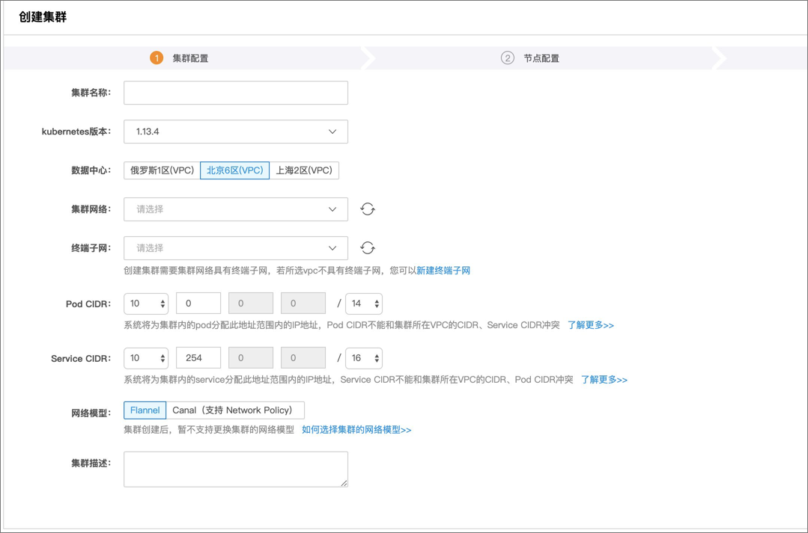

## How To Reproduce:


### Login
Login to [Kingsoft Cloud](https://passport.ksyun.com/) Website with your own kingsoft cloud account. If you don't have an account,please refer to the [page](https://passport.ksyun.com/register.html) to sign up an account first.

### Create Kubernetes Cluster
集群作为容器运行的基础云资源，创建集群是使用容器服务的第一步，在创建集群过程中，用户可以自定义集群中云服务器的数量、操作系统、数据盘等配置信息 创建集群分为以下三步：
1. 配置集群信息
2. 节点配置
3. 设置基本信息

点击金山云控制台左边菜单栏，选择【计算】-【容器引擎】，进入容器引擎的控制台，

##### 配置集群信息


    1）集群名称：用户自定义集群的名称，2-64个字符，支持中文，英文，数字，以及特殊字符-,.!$^*()%#&+/:;<=>[]_`{|}~

    2）Kubernetes版本：目前金山云kubernetes版本为1.10.5、1.12.3、1.13.4、 1.17.6和 1.18.3，自定义选择

    3）集群网络：选择集群所在的VPC网络

    4）终端子网：终端子网用于创建私网负载均衡，用于集群内master节点和node节点通信

    5）Pod CIDR：为集群内的Pod分配此网络地址段的IP，客户自定义三个私有网络作为Pod网段

    6）Service CIDR：为集群内的Service分配此网络地址段的IP，客户自定义三个私有网络作为Service网段

    7）网络模型：选择集群的网络模型，目前支持Flannel和Canal

    8）集群描述：集群的描述，用户自定义填写

##### 节点配置
用户自定义集群中节点的配置和网络信息：

    1）计费模式：暂时只支持按日配置付费（月结）和按小时配置实时付费的计费方式

    2）master管理模式：当前仅支持独立部署模式，托管模式集群正在内测中，敬请期待

    3）节点类型：目前支持选择普通云主机和专属云主机创建集群

    4）安全组：定义集群中节点所属的安全组，关于容器集群安全组推荐设置，请参考容器集群安全组推荐设置

##### Master&Etcd节点选择


    1）可用区：选择节点部署的可用区

    2）集群网络-子网：选择节点部署的VPC内的子网信息

    3）云服务器系列：自定义选择云服务器的系列

    4）云服务器类型：自定义选择云服务器的类型

    5）CPU配置：自定义CPU的配置，推荐>=4核

    6）内存配置：自定义内存的配置，推荐>=8G

    7）操作系统：目前金山云容器引擎仅支持CentOS 7.3 64位和Ubuntu-18.04 64位节点镜像

    8）系统盘：本地SSD，20G

    9）数据盘：本地SSD，自定义数据盘大小

    11）购买数量：目前master节点数量只能是3个，支持挎可用区部署

##### Worker节点选择

配置信息同Master&Etcd

##### 设置基本信息


    1）所属项目：自定义购买的云资源的所属项目

    2）服务器名称：自定义服务器名称，2-64个字符，支持中文，英文，数字，以及特殊字符-,.!$^*()%#&+/:;<=>[]_`{|}~

    3）登录方式：用户自定义选择登录方式，支持设置密码和密钥登录

点击【创建】按钮，执行集群创建的操作，在集群列表页中可查询创建的集群


##### Access to Cluster
Once you Kubernetes cluster is active, Download it's kubeconfig file on the cluster details page and save it locally.


### Run Conformance Test
1. Download a sonobuoy [binary release](https://github.com/heptio/sonobuoy/releases) of the CLI, or build it yourself by running:
    ```sh
    $ go get -u -v github.com/heptio/sonobuoy
    ```

1. Configure your kubeconfig file by running:
    ```sh
    $ export KUBECONFIG="/path/to/your/cluster/config"
    ```

3. Run sonobuoy:
    ```sh
    $ sonobuoy run
    ```

4. Watch the logs:
    ```sh
    $ sonobuoy logs
    ```

5. Check the status:
    ```sh
    $ sonobuoy status
    ```

6. Once the status commands shows the run as completed, you can download the results tar.gz file:
    ```sh
    $ sonobuoy retrieve
    ```