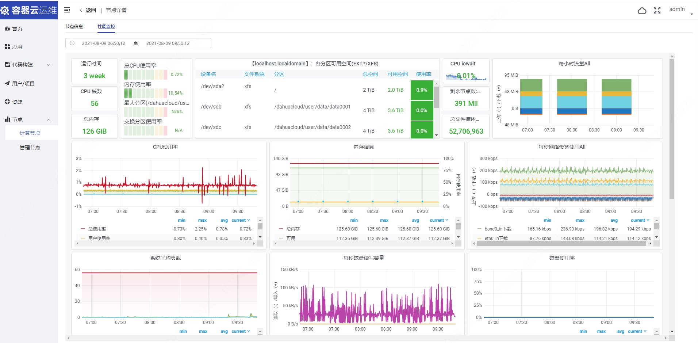

# To recreate these results

## 1.Introduction

Based on intelligent cloud service of Dahua video, Dahua Magic Cube Platform is an intelligent-application center platform that provides rich cloud services, which including hardware resource pooling, resource allocation on demand, continuous integration(CI), continuous delivery(CD) and so on.

The overall architecture of Dahua Magic Cube Platform:


**Key Features of MagicCube Platform**
**K8s Resource Management** : Provide a web console for creating and managing Kubernetes resources;provide native, scalable and compatible Kubernetes API that enables enterprises to migrate toward cloud business seamlessly.
**Efficient Management and Scheduling**：Support for mass hardware devices, network traffic and batch tasks; support deployment of multiple services in a stable and efficient manner to help users to improve resource utilization significantly.
**Storage Management**: Support multiple storage types, on-demand allocation of storage resources;support local storage and distributed storage scheduling.
Network Management: Support single cluster with multi-network; support load balancing; support real and fixed IP.
**Application template orchestration**: Application template lifecycle management, startup sequence of visual orchestration, multi-environment rapid deployment service.
**Multi-tenant Management**：Provide unified authentication with fine-grained roles and three-tier authorization system.

**Components List**

| Component      | Function description                                         |
| -------------- | ------------------------------------------------------------ |
| Infrastructure | supports ARM architecture, GPU management, CPU management and etc. |
| K8S/Docker     | provides application orchestration and container runtime interface |
| Network        | supports Calico/Macvlan network policy                       |
| Storage        | supports distributed Ceph storage and local PV               |
| App Monitoring | provides monitoring metrics and services of nodes, pods, middleware and API object |
| Harbor         | provides images registry center                              |

These are some symbolic displays of Dahua Magic Cube Platform:

- First, the Project Overview of Dahua Magic Cube.


- Second, the detail information of work node.




- Three, the detail information include the usage of CPU, network bandwidth, the amount of memory.


## 2.Install Dahua Magic Cube Platform（Private Clouds）

Step1. Prepare three master node with CentOS 7.7 and one worker node

Step2. Install kubernetes v1.19 with a binary deployment

Step3. Install Calico CNI and CoreDNS

Step4. Install Dahua Magic Cube components

## 3.Run Conformance Tests

- Download Sonobuoy (0.52.0)

```
wget https://github.com/vmware-tanzu/sonobuoy/releases/download/v0.52.0/sonobuoy_0.52.0_linux_amd64.tar.gz
tar -xzf sonobuoy_0.52.0_linux_amd64.tar.gz
mv sonobuoy /usr/local/bin
```

- Prepare images

```
docker pull sonobuoy/sonobuoy:v0.52.0
docker pull sonobuoy/systemd-logs:v0.3
docker pull k8s.gcr.io/conformance:v1.19.4
```

- Run Sonobuoy

```
sonobuoy run --kubeconfig=/root/.kube/config --image-pull-policy=IfNotPresent --mode=certified-conformance --wait
```

- Check the status

```
sonobuoy status --kubeconfig=/root/.kube/config
```

- Inspect the logs

```
sonobuoy logs --kubeconfig=/root/.kube/config
```

- Once `sonobuoy status` shows the run as `completed`, download the results tar.gz file

```
result=$(sonobuoy retrieve --kubeconfig=/root/.kube/config)
tar xzf $result -C results/
```
